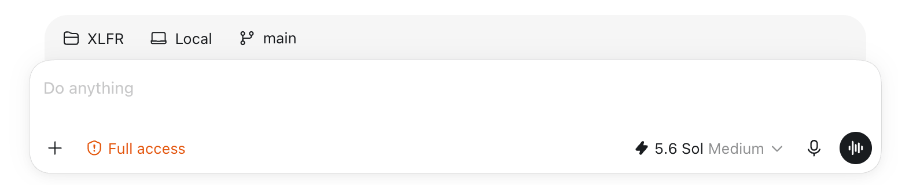
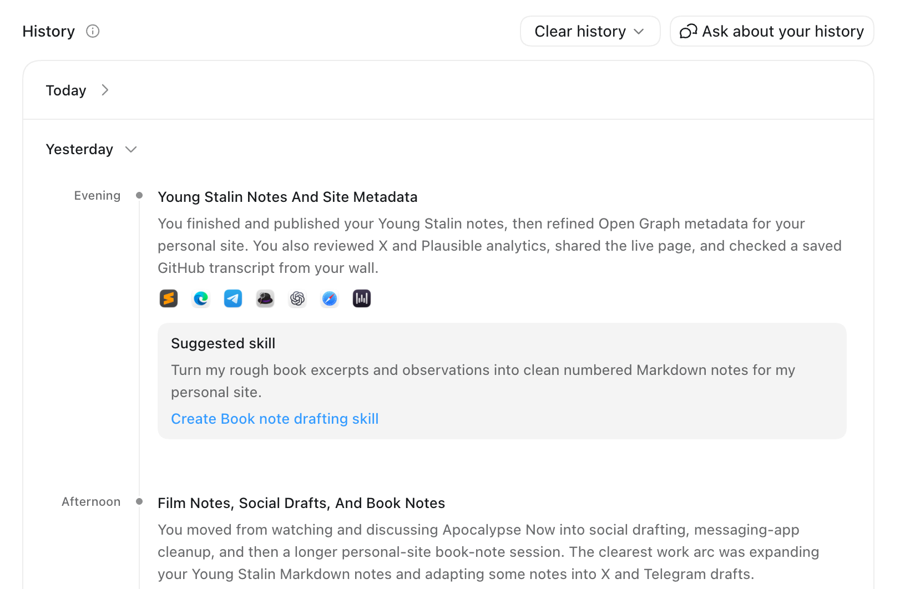
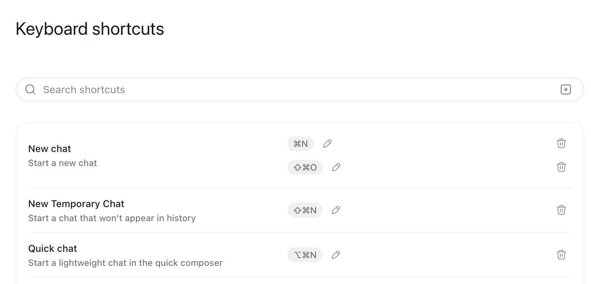
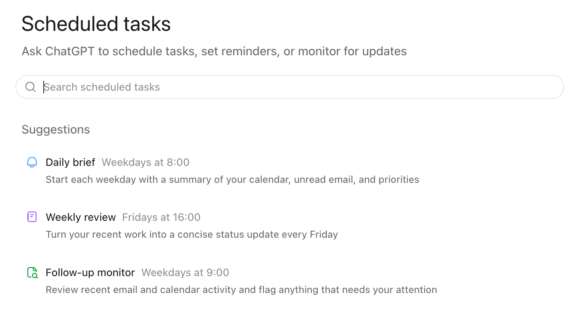

1. I almost completely ignore the three 'help' cards under the main prompt "What should we build in {project}". I barely even look at the text.
2. The main space is vast and white. It's empty but full of potential, like a blank page.
3. The secondary bar sat above the main bar hovers just above it. The grey shade makes it significant, but secondary. It seems to have no stroke so sort of fades rather than standing firm, which helps with the blended 'secondary' effect feel. I notice it vanishes as soon as the messages begin, almost like the information is there to help you make a decision, but then goes once you've begun. Where does it go?  
4. It goes into the 'pinned' list. There are options in there I never use. Are they useful or were they put in just to appease some edge case developers? Most of them can be done by a model now. It's like they're giving the paranoid users control. A lot of the commands I don't understand. Perhaps I should look into them?
5. The side panel slides in quite abruptly and takes up more space than I'd assume. Again, it has options I didn't know existed or barely noticed. The terminal is a nice feature, the file tree I never look at, but I now discover I can search for files with cmd+p like in VSCode. I'd been flitting between an editor and Codex before. Perhaps I can run it all through here now! I notice I can add code snippets to chat, that is unquestionably very useful and will change the way I work going forward. Suppose I have to be in a project for this to work. 
6. Annotate is infinitely useful. Helps me pinpoint certain things on a webpage or design and begin improving them straight away. It cuts through to the core workflow which is "Tell the models what they need to know". It shortcuts that job. Classic example of nailing a 'job to be done'.
7. 'Expand panel' isn't useful for some reason, I wonder who wanted it? 
8. The 'more' buttons on the browser have some quite neat tricks but with so much in there it's hard to stay on top. I tend to use the device toolbar. Going to the settings is where the bottomless pit opens up, so much config available across so many areas. On that note the 'Enable full CDP access' is inscrutable to me. Unsure why it's useful, quite unsure what the risks are. The 'Elevated risk' badge in the soft red is eyecatching though given the muted colours in the rest of the application.
9. The 'Review' side tab option has a really nice icon change between 'split diff|unified diff' that demonstrates the change.
10. The 'side chat' doesn't feel useful. Unclear how much it knows about the existing chat; if it knew everything about it would it be useful? Unsure, tend to just steer.
11. The integrated terminal doesn't seem to load my nerd fonts but it does open in the right folder so that's nice. I don't open it in the side though, use the cmd+j cos familiar from other IDEs.
12. It's funny how the side bar and vertical bar are sort of 'window splits' from Ghostty etc. The chat interface is king but can be broken up with these splits. Good that you can't subsplit cos window management can be a pain.
13. Deleted my archived chats, loved the toast evolution from 'confirm-actioning-success' the greens were really nice. The light green background with the dark green stroke, text and icon. The non-filled icon lets things breathe. 
14. I can quite easily archive chats in Codex by tapping 'archive' on the far right. No such luck in Chat mode. have to double click. Can't bulk archive so I just let them accumulate. As someone who likes to delete and have few things that's irksome. Risk of mass deleting things I actually find useful. Unclear what's in chat vs what's in codex. 
15. Settings are a brand new screen which is best because THERE ARE SO MANY OPTIONS. Get it though because it's powerful and has access to a lot.
16. New 'quick chat' isn't useful and is unexpected that it opens on the side. Would rather switch to proper chat via 'Chat' switcher. That said, now I know the shortcut maybe it's useful after all! In fact, quite like it now I've learnt its rhythms. 
17. The 'full access' red button warning is the same subtle red. Not 'red alert', more of an orange. Remind me I'm in a state. 
18. The fast 'lightning' is attractive. I like things that are lighning fast. The fact is uses 1.5x usage is worth it to me. Time is money, time is life. 
19. I switched to the 'advanced' model selector pattern some time ago. It's good how it's next to the 'send' since those items are logically paired (i.e. when you're sending you're thinking about what model to use and which will respond). Now I reflect on it the 'full access' lives next to the 'add files' - both of them responsible for 'how much context are you giving it'.
20. Microphone mode gives this sense of motion, the moving lines........ punctuated by the audio bars showing decibels. The 'transcribing' with the loading circle lets you know it's processing. The difference between 'cancel' (far right) and 'stop' right by 'send' is less clear than it could be. What does 'send' do that 'stop' doesn't? Presumably you can record multiple little segments?
21. Copy response, good response, bad response, fork. I use copy response but much less now that I can 'add to chat'. The 'more details' and 'ask in side chat' I barely use. Presumably the middle option was so common they thought it merited its own lane? The 'ask in side chat' I don't get, is it different from quick temporary chat or no? Investigating it appears it is, it has context from the existing chat and knows about the env. Perhaps useful to use to avoid clogging main context - need to know quite a lot about main context to get most value though.
22. Annotating responses is another infinitely useful thing I build all the time. I used to have to reference it manually by going through numbers. This feature has knocked that totally away. Amazing. 
23. Once a question is typed it fires up to the top of the screen and the 'thinking' flashes with a 'thinking for {n} seconds' being a second visual indicator of progress.
24. The 'more' buttons at the top of a project offer slightly more options than those in the sidebar which is only a touch confusing. Some of the interesting options are how to share the thread: deeplink, working dir, sessionID, markdown. All of that feels based around 'jobs to be done'.
25. Some nice options to organise the sidebar in various ways. Nice to be able to hide the sidebar, that animation is somehow smoother than the right-hand sidebar.
26. Option to organise by 'activity view' so you can quickly see what's been happening. What's the difference between this and organising sidebar by 'last activity'? That's unclear to me. Feels as though it may be redundancy.
27. Computer history interesting. The titles are outside the boxes with options boxed. The actual history timeline itself is nice, wrapped within stroked boxes, no shadow. Easy expansion of a given day. Then you have the day split into periods, linked with a timeline grey (subtle dot just after the title). Title and then summary of what's been happening. They grey section underneath clearly demarcates a 'notice this' moment where codex offers a 'suggested skill'. Unsure what the idea is here - to get it auto creating skills? To simply give it more context? This is something I'm considering turning off. Knowing everything I've typed into my computer or done on it is perhaps a bit much. Interesting how certain apps can be excluded by tapping on them and how it highlights all matching icons down the history list. 
28. Now looking at the 'appshots' setting. Again, nice clear header, followed by box hierarchy. Nice how there's a video on the right embedded showing how it works. 
29. Keyboard shortcuts have got out of hand after the codex/chatgpt merge. Some sort of reconciliation or product split needs doing to wrap my head around it. The search bar with 'search by keystroke' is a very interesting idea. The actual settings container is nice. Notice that this time the gap between options is not full width. Computer History seems the only one with full width separators, perhaps useful given the accordion and the finality of "Here's a different day" 
30. 'Sites' I've not looked at. Presume a competitor to Claude Artefacts. The icon suggests two large sites with smaller sites forking off it. Indicator that sites can be a variety of sizes and uses.

    

    Trying to create one punts me into another chat with a plugin type thing loaded into the chat. Don't fancy that - did I expect something more formal? Same thing with 'scheduled'. Interesting that scheduled list doesn't have a container whereas so many list items in the settings do.

    
31. Plugins has many options but almost like an app store, there are too many, need to go in with a mission and find the ones needed, e.g. Cloudflare. Once in there's a whole separate perms management step. Just noticed that I can look at 'plugins | skills' via a radio tab button group at the top. Hadn't seen before. Subtle.
